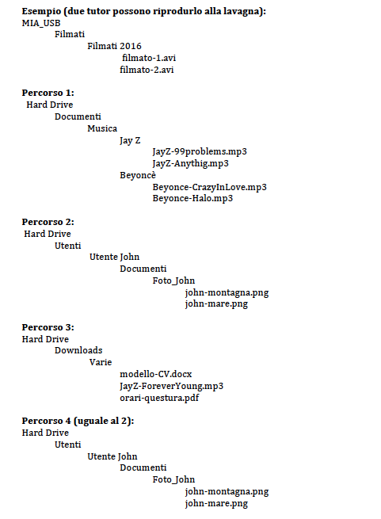

# Istruzioni

Stampare e ritagliare i singoli pezzi dei percorsi che trovate in questa cartella (ritagliare cioè separatamente ogni parola: "MIA_USB", "Filmati", etc.)

Formare 2 squadre. Ogni squadra riceve i pezzi **in disordine** di 2 percorsi e deve ricostruirli alla lavagna. 

Attenzione che alcuni file vanno sotto lo stesso livello!

Dare ai ragazzi circa 10 minuti per fare l'esercizio. Quando hanno finito, commentare insieme e correggere gli errori.

# Soluzioni

